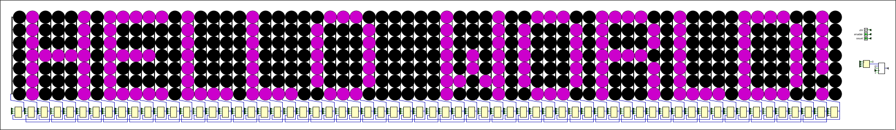

# generate-EEPROM-memory

We have a [Digital](https://github.com/hneemann/Digital) project implementing a simple von Neumann machine.

It has a scrolling 7px tall LED display and reads instructions in an EEPROM memory.

The 3 instructions are :
- Show : Scroll the display one step to the left and display the informations on the right most column
- Clear : Clears the display
- Jump : Make a jump in the memory (where to read instructions next)

&nbsp;



This python script converts user-input text into instructions to store in the EEPROM.

<!-- You can try it directly on this URL : https://eeprom-generator.static.domains/ -->

## Usage

1. Run the script.
2. Enter the desired text and mode.
3. The script will convert the text into instructions for the von Neumann machine.
4. The output will be saved to a file named "memory.hex" in the working directory.

## Symbol Set

The script uses a list of hexadecimal values to represent each character. If a character is not found, it replaces it with the **#** character.

## Example

```
python main.py
```
```
Enter your text:
> Hello World!
Choose your mode (once, cycle, repeat):
> cycle
File created/modified (memory.hex)
```
The script will generate the corresponding instructions and save them to "memory.hex".
