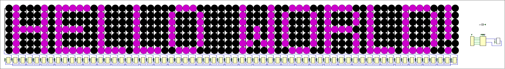

# generate-EEPROM-memory

We have a [Digital](https://github.com/hneemann/Digital) project reading in an EEPROM memory, displaying its content on a 7px tall LED display and making it scroll.



This python script converts user-input text into a hexadecimal representation to store in the EEPROM.

## Usage

1. Run the script.
2. Enter the desired text.
3. The script will convert the text into hexadecimal values based on the provided symbol set.
4. The output will be saved to a file named "memory.hex" in the working directory.

## Symbol Set

The script uses a list of hexadecimal values to represent each character. If a character is not found, it replaces it with the **#** character.

## Example

```
python main.py
```
```
Enter your text:
> Hello World!
```
The script will generate the corresponding hexadecimal values for each character and save them to "memory.hex".
